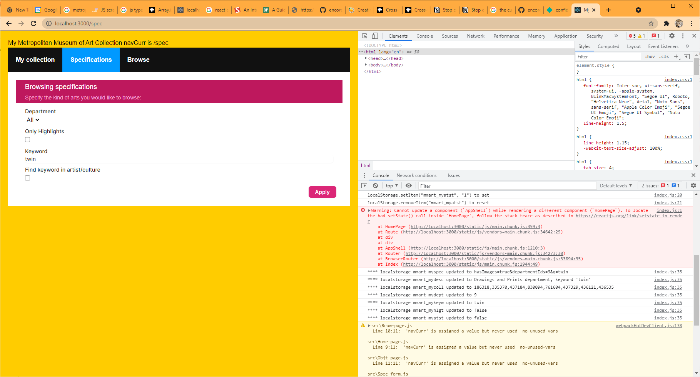

## Fundamentals in Frontend Development - END OF MODULE PROJECT (CAPSTONE PROJECT)
## Questions

<<<<<<< HEAD
# index.js:1 Warning: Cannot update a component (`AppShell`) while rendering a different component (`HomePage`).
I was experimenting using useContext to have a state in `app-shell.js` so that I can high-light the active 
navigation item on the nav bar, such as the picture below, where Specification is high-lighted as the current page:


I referenced this article: https://dmitripavlutin.com/react-context-and-usecontext/ to implment useContext.
=======
# Is my app correct
1. Please try the app, and let me know if it is close to what you require.

# on useEffect, general
2. Is this declarative statement `const [myBrows, setMyBrows] = React.useState([]);` considered an event of value change 
   for `myBrows`, and thus trigger `React.useEffect(() => {...}, [myBrows]);`?
>>>>>>> parent of 7db621a (useContext for navCurr)

3. If a `setTheVar(someValue)` does not cause `theVar` to change value because new value assigned is the same as the old,
   is this considered an event of value change for `theVar`, and thus trigger `React.useEffect(() => {...}, [theVar])'`?

# on chaining of useEffect, refer to Browse-page.js:
4. The following is my understanding and my rationale for the program coding.  The program seems to 
   work as I intended.  But as I spent more time with console.log and alert statements to trace them, they do not
   quite behave exactly as I expected.  Therefore I need your confirmation of my understanding.
   
```js
  React.useEffect(() => {
    setIsLoading(true);
    getObjects(storedMySpecStr).then((res) => {setObjCnt(res.total);setMyBrows(res.objectIDs);});
  }, []);
```  
  This I assume is executed once on page load.  After that, nothing will trigger it as there is 
  nothing in `[]`.  `setMyBrows()` fires API calls to obtain an array of objectIDs.

```js
  React.useEffect(() => {
    setIsLoading(true);
    setPageCnt(Math.max(1,Math.floor((myBrows.length+PAGESIZE-1) / PAGESIZE)));
  }, [myBrows]);
```
   When the previous `useEffect setMyBrows` finishes and thus changed `myBrows`, it triggers this useEffect, and causes `pageCnt`
   to be computed base on the number of items in the array `myBrows`.

<<<<<<< HEAD
2. In `app-shell.js`, I pull out `navCurr` so that I know which of the <Link to/> item I should high-light as actve:

=======
```js
  React.useEffect(() => {
    setIsLoading(true);
    setPageNum(Math.min(pageNum,pageCnt));
  }, [pageCnt]);
>>>>>>> parent of 7db621a (useContext for navCurr)
```
   When `pageCnt `is recomputed, this useEffect ensures that `pageNum` is never greater than `pageCnt`.  The is to 
   handle the situation when the single item on the last is deleted, `pageCnt` is reduced by 1 and becomes 
   smaller than `pageNum`, so `pageNum` has to be changed to `pageCnt`.

<<<<<<< HEAD
  const [navCurr, setNavCurr] = useState(''); 
  const value = useMemo(
    () => ({ navCurr, setNavCurr }),
    [navCurr]
  );

  return (
    <NavContext.Provider value = {value}>
      <div>
        <h1>My Metropolitan Museum of Art Collection navCurr is {navCurr}</h1>
          <ul className="header">
            <li><Link to="/" className={navCurr==="/"?"active":""} >My collection</Link></li>
            <li><Link to="/spec" className={navCurr==="/spec"?"active":""} >Specifications</Link></li>
            <li><Link to="/browse" className={navCurr==="/browse"?"active":""} >Browse</Link></li>
          </ul>
		  ...
      </div>
    </NavContext.Provider>
  );
};
```
3. In each of the pages related to `<Link to/>`:
```
...
import NavContext from './navContext';
...
export const BrowPage = ( {storedMyDescStr, myBrows, pageCnt , myColl, setMyColl, pageNum, setPageNum } ) => {
=======
```js
  React.useEffect(() => {
    setIsLoading(true);
    setPageBrows(myBrows.slice((pageNum-1) * PAGESIZE, (pageNum) * PAGESIZE));
  }, [myBrows, pageNum]);
```
   When `myBrows` or `pageNum` change, `setPageBrows` re-slices another `PAGESIZE` items from `myBrows`.  Items in 
   `pageBrows` are to be listed on the html page.
>>>>>>> parent of 7db621a (useContext for navCurr)

```js
  React.useEffect(() => {
    setIsLoading(false);
  }, [pageBrows]);
```
   When `pageBrows` finishes updating and gets a new `PAGESIZE` items of objectIds, `setIsLoading(false)` causes 
   the button label to return from `Loading...` back to their original label.  It is this that does not work and
   caused my doubt over my understanding.

# Localstorage and Integration
   
5. Looking at Home-page.js, the personal collection is stored in a string kept in localstorage.  The string is read from 
   localstorage on page load, and saved to localstorage each time it is updated.  Is this a proper way to handlle this
   situation?

6. Currently, each page runs independently.  When user switches page, the page reloads instead of resuming from where it
   was.  I tried to lift the states from individual page to the main (index.js) but I do not seem to know how to. 
   I need your advice here, or alternatively I may make further use of the localstorage to cause the pages to
   function more seamlessly.  However, I am not sure if this is correct and whether it is doable.

<<<<<<< HEAD
Could this have anything to do with my deployment of useContext?  The syntax looks odd and clumpsy to me, especially `<NavContext.Provider value = {value}>`
How to I add more variables to useContext?
=======
  
>>>>>>> parent of 7db621a (useContext for navCurr)
